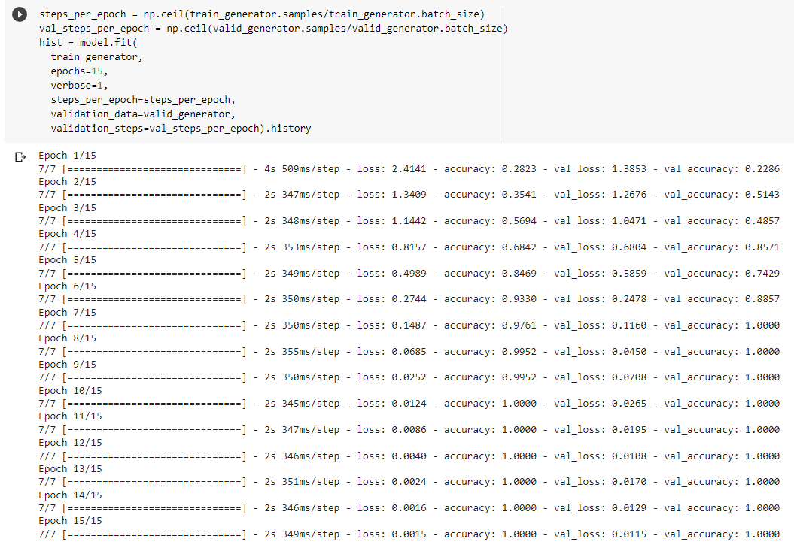
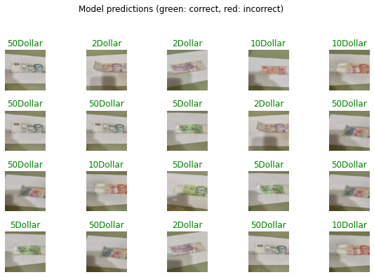
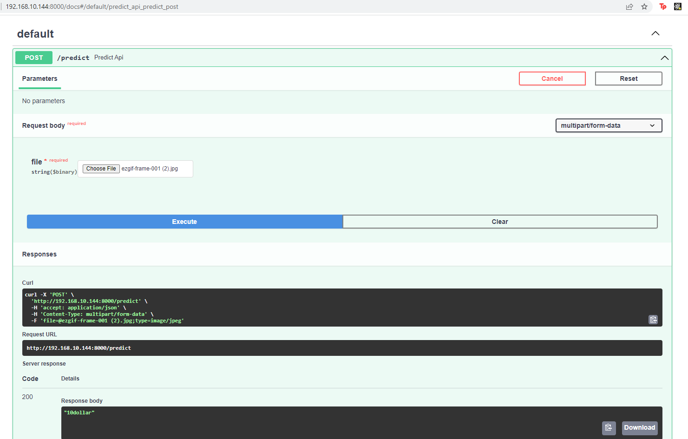

# CZ4171: Internet of Things: Communication & Networking

## Money Detection!

# Part 1: Training Machine Learning Model

The model is trained via google colab using their GPU, the dataset used contained 250 custom pictures of the Singapore Dollar(SGD). 
- Epochs: 15
- Batch Size: 32
- Optimizer: Adam
- Loss: categorical_crossentropy

The result of this training are as follows:

## Accuracy per Epoch

## Sample predictions on input images

With the completed training, the model will be exported to Tensorflow in the Keras format under my_model folder.

The training images and saved model can be found in this drive: 
<a href="https://drive.google.com/drive/folders/1psxBNAUH8L5OcEMnzhKs2r7q-w_83T4X?usp=sharing" target="_blank">Google Drive</a>

# Part 2: Building Backend Endpoint

The backend server will be hosted locally and deployed via FastApi framework to allow easy debuging and ease of use. FastApi provides a web UI to test out the different api endpoints. Tensorflow is also installed locally to carry out the prediction. By default, fastapi supports concurrency and multiple user via async endpoints which is used to build our "predict" endpoint.

# Part 3: Mobile Application

The mobile application was created using Flutter. This allows for cross-platform development using a single code base. For this project, I will primarily be focusing on Android. The source code for the app can be found in _'/CX4171 Project - Bank Note Image Classification/iotbanknoteclassification'_. Please read the README.md inside the folder to know how to set up the app.

## Main Page

A placeholder shows where the image the user selected will be displayed. The app allows the user to upload an image either using the smartphone's native camera or from the user's gallery. Once the user selected an image, they can tap on submit to send the image to the server.

# Grade CheckList

- Cloud Inference:
  - Run inference in cloud virtual machine (10)
    - Model is deployed as a endpoint on local machine :white_check_mark:
  - Communicate between IoT device & cloud (20)
    - App can send image data to local server end point for inference :white_check_mark:
    - Results from the model's prediction can be sent back from the cloud to the app :white_check_mark:
- Advanced Tasks:
  - Train your own model (10)
    - Trained my own simple CNN model  :white_check_mark:
  - Support multiple concurrent users (10)
    - FastApi Async Endpoint to support multiple concurrent users:white_check_mark:

